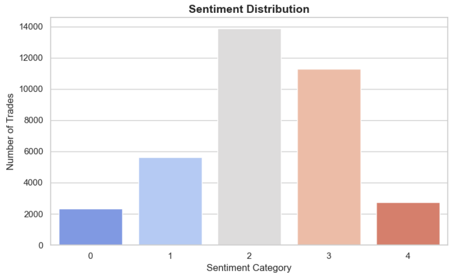
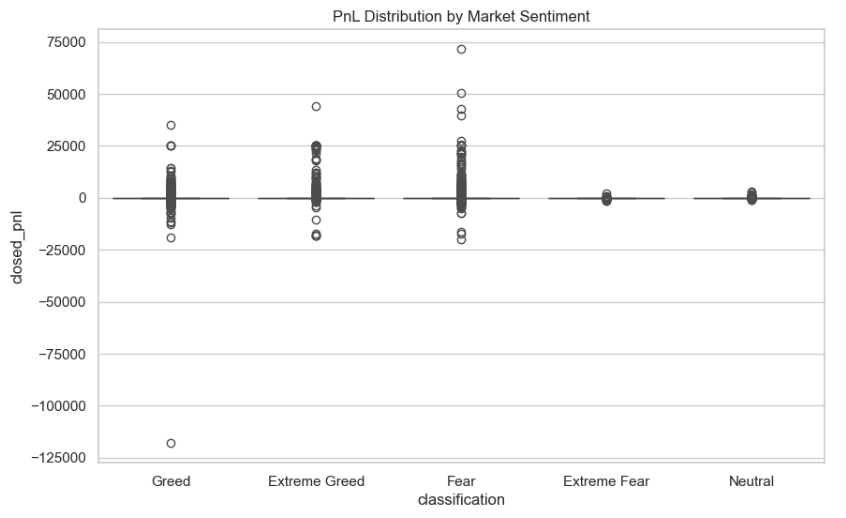
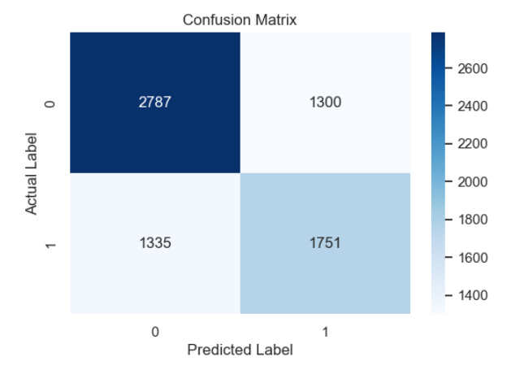

🚀 End-to-end data science project combining trading data with market sentiment to derive actionable insights.

Key finding: Trader performance is driven more by risk management than sentiment alone.

# 📈 NLP-Based Financial Sentiment Analysis for Market Insights

> 📊 End-to-end data analysis project demonstrating how market sentiment impacts trading performance and decision-making.
----
## 🚀 Project Summary

This project analyzes how market sentiment influences trading performance using real trading data.

- Built classification model to predict sentiment  
- Achieved ~63% accuracy using Logistic Regression  
- Discovered that sentiment impacts win rate and profitability  

-----
## 📌 Problem Statement

Financial markets are heavily influenced by public sentiment from news and social media. 
Understanding whether sentiment is bullish, bearish, or neutral can help traders and analysts make better decisions.

This project aims to analyze textual data and classify sentiment to uncover market trends.

---

## 📌 Objective
Analyze how market sentiment (Fear/Greed) influences trader behavior, risk-taking, and profitability.

---

## 💼 Business Use Case

- Helps investors understand market mood  
- Supports data-driven trading decisions  
- Identifies sentiment trends from financial text data

---

## 📂 Dataset Sources

- Historical Trader Data (Hyperliquid): [https://drive.google.com/file/d/1IAfLZwu6rJzyWKgBToqwSmmVYU6VbjVs/view]
- Bitcoin Market Sentiment (Fear/Greed Index): [https://drive.google.com/file/d/1PgQC0tO8XN-wqkNyghWc_-mnrYv_nhSf/view]

Note: Datasets are provided via external links due to size constraints.
---

## ⚙️ Methodology

- Data cleaning and preprocessing  
- Timestamp conversion and alignment  
- Merging datasets on date  
- Feature engineering (PnL, trade size, win rate)  
- Behavioral and performance analysis  
- Visualization and insights  
- Predictive modeling (bonus)  

---

## 🛠️ Tools & Technologies

- Python (Pandas, NumPy)
- Scikit-learn (ML models)
- Matplotlib, Seaborn (visualization)
- Jupyter Notebook

---
## 🔍 Key Insights

- Model shows moderate performance, indicating scope for improvement  
- Lower recall for one class suggests difficulty in correctly identifying certain sentiments  
- Performance can be improved with better feature engineering and advanced NLP models  

---

## ⚙️ Approach

1. Data Collection (news/social media)
2. Data Cleaning (remove noise, stopwords)
3. Text Preprocessing (tokenization, normalization)
4. Feature Extraction (TF-IDF / Bag of Words)
5. Model Training (Logistic Regression, Naive Bayes)
6. Evaluation (Accuracy, Precision, Recall)

----

## 🚀 Strategy Recommendations

- Reduce position sizes during Fear periods to avoid emotional trading  
- Increase participation during Extreme Greed phases  
- Focus on disciplined execution rather than increasing exposure  

---

## 📊 Key Insights

- Traders take higher risks during Fear but achieve lower returns  
- Extreme Greed phases show highest profitability  
- Trade size influences profitability more than sentiment

  
## 🤖 Bonus: Predictive Model

- Built a Random Forest model to predict trade profitability  
- Achieved ~63% accuracy after removing data leakage  
- Found that **trade size dominates prediction over sentiment**

---

## 📊 Sample Visualizations

---

### 📊 Sentiment Distribution


- Majority of trades occur under **neutral sentiment**
- Extreme sentiments are less frequent

---

### 💰 Profit Distribution by Sentiment


- Profit varies significantly across sentiment categories  
- Some categories show higher volatility

---

### 📦 Trade Size Analysis


- Trade size differs across sentiment groups  
- Indicates varying risk-taking behavior

---

### 🔍 Confusion Matrix


- Correct predictions are balanced across classes  
- Some misclassification exists, showing scope for improvement
-  The model struggles slightly with class imbalance, indicating potential for feature engineering improvements

-----

### 🔍 Interpretation

- The model correctly predicted **2787 instances of class 0** and **1751 instances of class 1**  
- Misclassifications include **1300 false positives** and **1335 false negatives**  
- The model shows relatively balanced performance across both classes  
- However, there is still room for improvement in reducing misclassification errors  

### 📈 Key Insight

- The model performs slightly better at identifying class 0 compared to class 1  
- Improving feature engineering and using advanced NLP models could enhance classification accuracy

----

## 📈 Results

- Achieved **63.27% accuracy** using Logistic Regression  
- Model shows balanced performance with F1-score ~0.63  
- Slightly better performance for one class compared to others  

------


## ▶️ How to Run

1. Download notebook  
2. Install requirements:
```bash
pip install pandas numpy matplotlib seaborn scikit-learn


