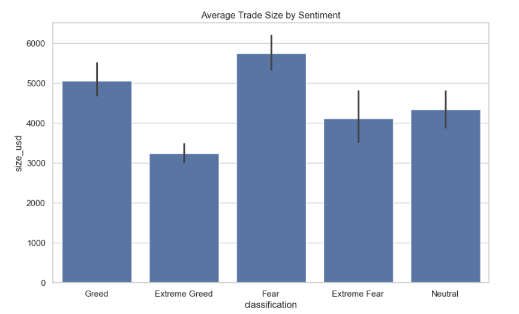

🚀 End-to-end data science project combining trading data with market sentiment to derive actionable insights.

# Trader Performance vs Market Sentiment Analysis

## 📌 Objective
Analyze how market sentiment (Fear/Greed) influences trader behavior, risk-taking, and profitability.

---

## 📂 Datasets
- Historical Trader Data (Hyperliquid)
- Bitcoin Market Sentiment (Fear/Greed Index)

---

## ⚙️ Methodology

- Data cleaning and preprocessing  
- Timestamp conversion and alignment  
- Merging datasets on date  
- Feature engineering (PnL, trade size, win rate)  
- Behavioral and performance analysis  
- Visualization and insights  
- Predictive modeling (bonus)  

---

## 📊 Key Insights

- Traders take **larger positions during Fear**, but profitability is lower → inefficient risk-taking  
- **Extreme Greed shows highest profitability**, indicating strong market conditions  
- Trade size has a **greater impact on profitability than sentiment alone**  

---

## 🚀 Strategy Recommendations

- Reduce position sizes during Fear periods to avoid emotional trading  
- Increase participation during Extreme Greed phases  
- Focus on disciplined execution rather than increasing exposure  

---

## 📊 Key Insights

- Traders take higher risks during Fear but achieve lower returns  
- Extreme Greed phases show highest profitability  
- Trade size influences profitability more than sentiment

  
## 🤖 Bonus: Predictive Model

- Built a Random Forest model to predict trade profitability  
- Achieved ~63% accuracy after removing data leakage  
- Found that **trade size dominates prediction over sentiment**

---

## ▶️ How to Run

1. Download notebook  
2. Install requirements:
```bash
pip install pandas numpy matplotlib seaborn scikit-learn

## 📊 Sample Visualizations




